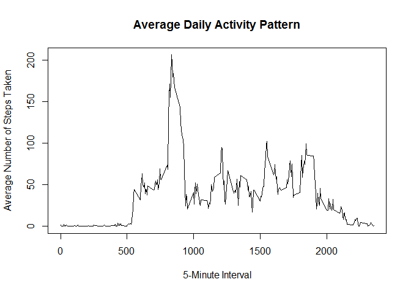
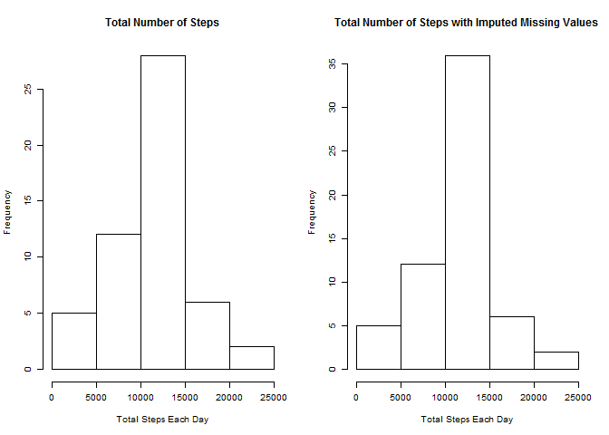

# Reproducible Research: Peer Assessment 1


## Loading and preprocessing the data
Load the data (i.e. read.csv()).  Process/transform the data (if necessary) into a format suitable for your analysis.

```r
library(data.table)
unzip("activity.zip", overwrite = TRUE)
activity <- read.csv("activity.csv")
activity <- data.table(activity)
summary(activity)
```

```
##      steps               date          interval   
##  Min.   :  0.0   2012-10-01:  288   Min.   :   0  
##  1st Qu.:  0.0   2012-10-02:  288   1st Qu.: 589  
##  Median :  0.0   2012-10-03:  288   Median :1178  
##  Mean   : 37.4   2012-10-04:  288   Mean   :1178  
##  3rd Qu.: 12.0   2012-10-05:  288   3rd Qu.:1766  
##  Max.   :806.0   2012-10-06:  288   Max.   :2355  
##  NA's   :2304    (Other)   :15840
```


## What is mean total number of steps taken per day?
1. Make a histogram of the total number of steps taken each day.

```r
tsteps <- activity[, sum(steps), by=date]
hist(tsteps$V1, 
    main = "Total Number of Steps Taken Each Day", 
    xlab = "Total Steps")
```

 

2. Calculate and report the mean and median total number of steps taken per day.

```r
m1 <- format(mean(tsteps$V1, na.rm = TRUE), nsmall=2)
m2 <- median(tsteps$V1, na.rm = TRUE)
```
The mean is 10766.19 and the median is 10765.

## What is the average daily activity pattern?
1. Make a time series plot (i.e. type = "l") of the 5-minute interval (x-axis) and the average number of steps taken, averaged across all days (y-axis).

```r
msteps <- activity[, mean(steps, na.rm=TRUE), by=interval]
with(msteps, plot(interval, V1, 
                  type="l", 
                  main="Average Daily Activity Pattern",
                  ylab="Average Number of Steps Taken",
                  xlab="5-Minute Interval"))
```

 

2. Which 5-minute interval, on average across all the days in the dataset, contains the maximum number of steps?.

```r
max_steps = max(msteps$V1)
m1 <- msteps[V1 == max_steps]$interval
m1time <- substr(as.POSIXct(sprintf("%04.0f", m1), format='%H%M'), 12, 16)
```
The 5-minute interval with the maximun number of steps is 835 or 08:35 (with a maximum steps of 206.1698).


## Imputing missing values
1. Calculate and report the total number of missing values in the dataset (i.e. the total number of rows with NAs)

```r
missval <- sum(!complete.cases(activity[-1]))
```
The total number of missing values in the dataset is 2303

2. Devise a strategy for filling in all of the missing values in the dataset. The strategy does not need to be sophisticated. For example, you could use the mean/median for that day, or the mean for that 5-minute interval, etc.

The strategy being used for filling in all missing values will be to use the mean for that 5-minute interval that is missing a value.

3. Create a new dataset that is equal to the original dataset but with the missing data filled in.

```r
cactivity <- activity
cactivity$steps <- ifelse(is.na(cactivity$steps) == TRUE, 
                          msteps$V1[msteps$interval %in% cactivity$interval],
                          cactivity$steps)
summary(cactivity)
```

```
##      steps               date          interval   
##  Min.   :  0.0   2012-10-01:  288   Min.   :   0  
##  1st Qu.:  0.0   2012-10-02:  288   1st Qu.: 589  
##  Median :  0.0   2012-10-03:  288   Median :1178  
##  Mean   : 37.4   2012-10-04:  288   Mean   :1178  
##  3rd Qu.: 27.0   2012-10-05:  288   3rd Qu.:1766  
##  Max.   :806.0   2012-10-06:  288   Max.   :2355  
##                  (Other)   :15840
```


4. Make a histogram of the total number of steps taken each day and Calculate and report the mean and median total number of steps taken per day. Do these values differ from the estimates from the first part of the assignment? What is the impact of imputing missing data on the estimates of the total daily number of steps?

```r
tsteps <- activity[, sum(steps), by=date]
ctsteps <- cactivity[, sum(steps), by=date]
par(mfrow = c(1, 2), cex = 0.6)
hist(tsteps$V1, 
    main = "Total Number of Steps", 
    xlab = "Total Steps Each Day")
hist(ctsteps$V1, 
    main = "Total Number of Steps with Imputed Missing Values", 
    xlab = "Total Steps Each Day")
```

 

```r
m1 <- format(mean(tsteps$V1, na.rm = TRUE), nsmall=2)
m2 <- format(median(tsteps$V1, na.rm = TRUE), nsmall=2)
cm1 <- format(mean(ctsteps$V1, na.rm = TRUE), nsmall=2)
cm2 <- format(median(ctsteps$V1, na.rm = TRUE), nsmall=2)
```
The mean with imputed missing values is 10766.19 compared to 10766.19.  The median with missing values is 10766.19 compared with 10765.  The values are similar.  The impact of imputing missing data on the estimates of the total daily number of steps appears to be minimal.


## Are there differences in activity patterns between weekdays and weekends?
1. Create a new factor variable in the dataset with two levels - "weekday" and "weekend" indicating whether a given date is a weekday or weekend day.

```r
cactivity$weekend <- weekdays(as.Date(cactivity$date,"%Y-%m-%d")) %in% c('Sunday', 'Saturday')
```
 
2. Make a panel plot containing a time series plot (i.e. type = "l") of the 5-minute interval (x-axis) and the average number of steps taken, averaged across all weekday days or weekend days (y-axis). 

```r
library(lattice)
cactivity$wday <- ifelse(cactivity$weekend == FALSE, "Weekday", "Weekend")
wmsteps <- cactivity[,list(avg = mean(steps)),by = list(interval,wday)]

we_m <- mean(wmsteps[wday == "Weekend"]$avg, na.rm = TRUE)
we_i <- wmsteps[avg == max(wmsteps[wday == "Weekend"]$avg)]$interval
we_time <- substr(as.POSIXct(sprintf("%04.0f", we_i), format='%H%M'), 12, 16)

wd_m <- mean(wmsteps[wday == "Weekday"]$avg, na.rm = TRUE)
wd_i <- wmsteps[avg == max(wmsteps[wday == "Weekday"]$avg)]$interval
wd_time <- substr(as.POSIXct(sprintf("%04.0f", wd_i), format='%H%M'), 12, 16)

xyplot( avg ~ interval | wday, data = wmsteps, 
        layout = c(1,2), type="l", 
        ylab="Number of steps", 
        xlab="Interval", 
        main="Average Number of Steps Taken")
```

 

There are differences in activity between weekend and weekday.  The charts show that there is more activity throughout the day during the weekend and the average number of steps is greater during the weekend (42.3664) than the weekday (35.6106).  In addition, the maximum number of steps taken is later in the day for the weekend (915 or 09:15) versus the weekday (835 or 09:15).
